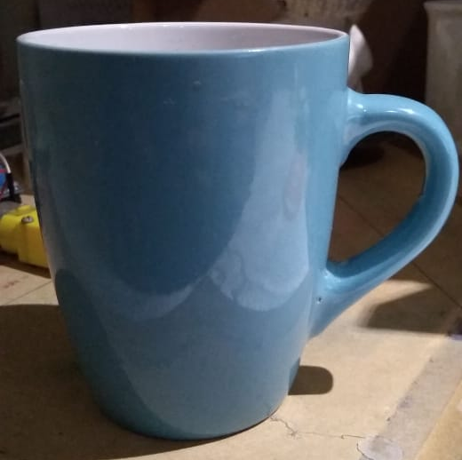
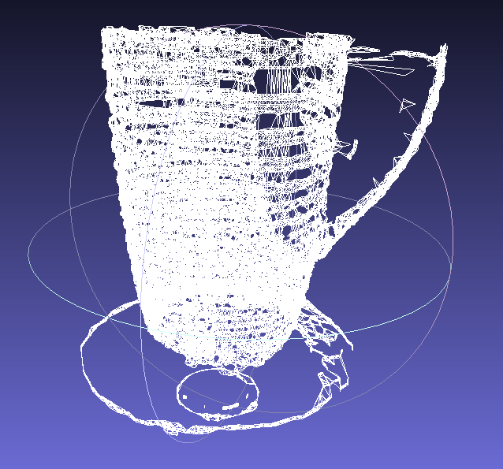

## Escaner3D-Grafica
Repositorio para el proyecto de escáner 3D basado en linea láser para el curso de Computación Grafica

## Integrantes

1. Espinel Quispe Ingrid

## Resultados

### Taza

Taza Real

Reconstruccion 3D Taza

